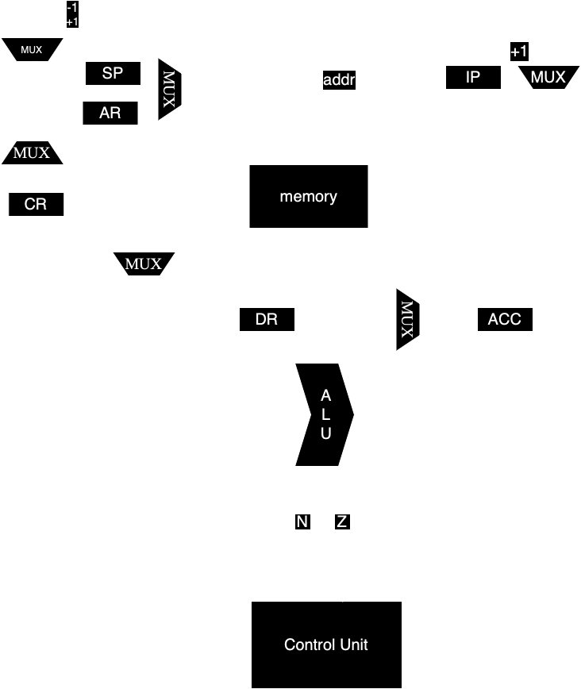
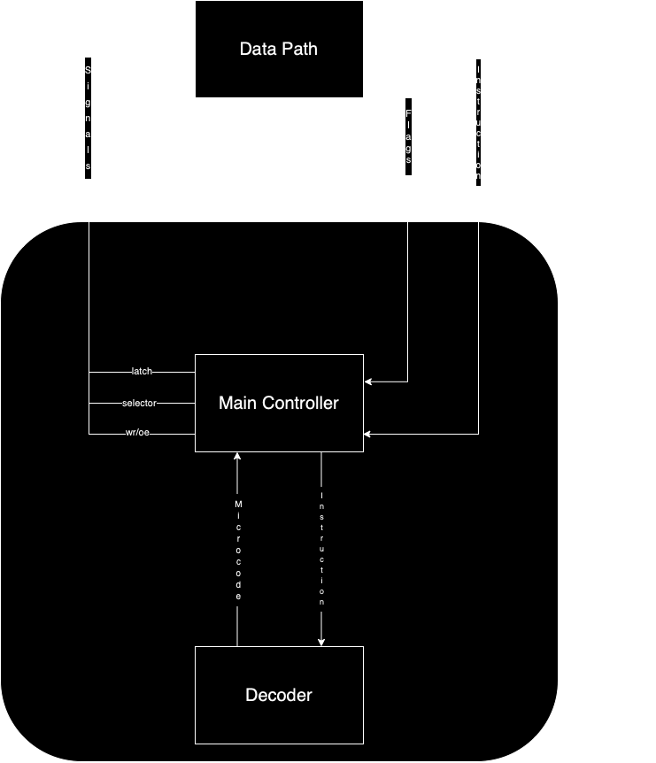

# csa lab 3

___

- Птицын Максим Евгеньевич P33311
- `alg | acc | neum | mc | tick | struct | stream | mem | cstr | prob2 | 8bit`
- Без усложнения

___

## Язык программирования

Язык Java-подобный, с глобальной областью видимости. Типы данных: int и str. Типизация статическая.

```EBNF
prog ::= statement{statement}
statement ::= assign | conditional | while | io 
assign ::= str variable "=" expression ";" | int variable "=" expression ";"
variable ::= letter{letter}
expression ::= arith_exp | variable | literal
conditional ::= "if" (" bool_exp ")" "{" prog "}"
bool_exp ::= variable ( "<" | ">" | "==" )  integer | variable % integer == integer
while ::= "while" "(" bool_exp ")" "{" prog "}"
arith_exp ::= ( variable | literal ){ op arith_exp }
literal ::= integer | string
integer ::= digit+
io ::= "read(" variable ")" ";" | "print(" (variable|string) ")" ";"
string ::= "'" character{character} "'"
character ::= letter | number 
letter ::= a | ... | A ... | Z
digit ::= 0 | ... | 9
op ::= "+" | "-" | "*" | "/"
```

## Организация памяти

```
               Registers
+------------------------------------+
| ACC - аккумулятор                  |
+------------------------------------+
| CR - хранение инструкций           |
+------------------------------------+
| DR - хранение данных               |
+------------------------------------+
| IP - указатель на след. инструкцию |
+------------------------------------+
| SP - указатель на вершину стека    |
+------------------------------------+
| AR - адрес для чтения или записи   |
+------------------------------------+

```

- Память данных и команд общая (фон Нейман)
- Константы отсутствуют
- Переменные помещаются на стек

### Работа со строковыми литералами:

- Строковые литералы хранятся в памяти последовательно
- В одном машинном слове хранится 1 символ строкового литерала
- При инициализации типа str, символы строки в памяти хранятся последовательно после всех инструкций или после
  последнего строкового литерала и представлены командой NOP

## Система команд

- Доступ к вводу-выводу происходит через специальные команды READ  (1 - Порт для буффера, 2 - Порт для вывода), порты
  конфигурируются в [isa](machine/isa.py)

Цикл команды:

- Выборка инструкции -- mem[IP] -> CR, IP+1 -> IP (1 такт)
- Выборка операнда (2-3 такта) --
    - addr-> AR, mem[AR] -> DR (абсолютная);
    - addr -> DR (прямая);
    - addr -> AR, mem[AR] -> AR, mem[AR] -> DR (косвенная)
- Выполнение команды (1-3 такта)

### Набор инструкций

| Инструкция     | Описание                                                                               |
|:---------------|:---------------------------------------------------------------------------------------|
| PUSH           | Положить на стек данные из аккумулятора                                                |
| NOP            | Отсутствие действий                                                                    |
| POP            | Загрузить в аккумулятор данные с вершины стека                                         |
| HALT           | ОСТАНОВ                                                                                |
| INC            | Прибавить к данным в аккумуляторе 1                                                    |
| ST `operand`   | Сохранить в память данные из аккумулятора                                              |
| LD  `operand`  | Загрузить в аккумулятор данные из памяти                                               |
| ADD `operand`  | Сложить данные из аккумулятора с данными из памяти, записать результат в аккумулятор   |
| SUB `operand`  | Вычесть из данных из аккумулятора данные из памяти, записать результат в аккумулятор   |
| MUL `operand`  | Умножить данные из аккумулятора на данные из памяти, записать результат в аккумулятор  |
| DIV `operand`  | Разделить данные из аккумулятора на данные из памяти, записать результат в аккумулятор |
| JUMP `operand` | Перейти по адресу                                                                      | 
| CMP `operand`  | Выставить значения флагов при вычитании из данных из аккумулятора данных из памяти     | 
| JE `operand`   | Перейти по адресу, если флаг Z == 1                                                    |
| JNE `operand`  | Перейти по адресу, если флаг Z == 0                                                    |              
| JA `operand`   | Перейти по адресу, если флаг N == 0                                                    |
| JB `operand`   | Перейти по адресу, если флаг N == 1                                                    |

### Кодирование инструкций

- Машинный код сериализуется JSON, состоит из элементов:
  - `index` -- адрес в памяти
  - `opcode` -- код операции
  - `arg1` -- вид адресации
  - `arg2` -- аргумент

Типы данных в модуле [isa](machine/isa.py), где:

- `Opcode` -- коды операций
- 'TypesOfAddressing' -- виды адресации

## Транслятор
Вызов: `translator.py <input_file> <target_file>`
Этапы трансляции:
1. [lexer](translator/lexer.py) -- трансформирование текста в последовательность значимых термов
2. [AST](translator/ast.py) -- перевод представления из первого этапа в AST-дерево
3. [translator](translator/translate.py) -- трансляция AST в машинный код

## Модель процессора
Вызов: `processor.py <machine_code_file> <input_file>`

**Datapath**



[data_path.py](machine/data_path.py).

Регистры:
- `ACC`
- `DR`
- `CR`
- `AR`
- `SP`
- `IP`

Сигналы:

- `latch_cr`,
- `latch_ip`,
- `latch_ar`,
- `signal_oe`,
- `sel_dr`,
- `latch_dr`,
- `latch_left_op`,
- `latch_right_op`,
- `signal_calculate`,
- `latch_acc`,
- `signal_wr`,
- `latch_sp`,
- `latch_in`,
- `latch_out`

Селекторы для мультиплексоров реализованы с помощью Enum в [data_path.py](machine/data_path.py) классом Selector

Флаги:

- `N` (negative) -- результат в алу содержит отрицательное число
- `Z` (zero) -- результат в алу содержит ноль

**ControlUnit**



Реализован в [controlunit.py](machine/controlunit.py).

- Получает из DataPath команду, декодирует её
- Выполняет микрокод:
    - Включает в себя сигналы и мультиплексоры для DataPath
    - Хранится в отдельной памяти в Control Unit
    - Названия каждого бита:
        - **latch_cr** -- защелкнуть адресный регистр
        - **sel_ip** -- Мультиплексор для ip
        - **latch_ip** -- защелкнуть счетчик команд
        - **sel_ar**  -- Мультиплексор для ar
        - **latch_ar** -- защелкнуть адресный регистр
        - **sel_oe** -- Мультиплексор для oe
        - **signal_oe** -- сигнал для чтения
        - **sel_dr** -- Мультиплексор для dr
        - **latch_dr** -- защелкнуть регистр данных
        - **latch_left_op** -- -- ACC -> left_operand
        - **latch_right_op** -- ACC -> right_operand
        - **signal_calculate** -- выполнить операцию на АЛУ
        - **check_flags** -- проверка флагов
        - **sel_acc** -- Мультиплексор для acc
        - **latch_acc** -- защелкнуть аккумулятор
        - **sel_wr** -- Мультиплексор для wr
        - **signal_wr**  -- сигнал на запись в память
        - **sel_sp** -- Мультиплексор для sp
        - **latch_sp** - защелкнуть SP
        - **latch_out** -- Запись в порт для выхода
        - **mux_port** -- Выбор порта
        - **latch_in** -- Запись в порт для входа
        - **mux_mPC** -- 4 возможных значения
            - +1 -- переход к следующей микрокоманде
            - 0 -- переход к 0 микрокоманде
            - DECODE_OP_FETCH -- декодировать цикл выборки операнда
            - DECODE_COMMAND -- декодировать исполнение команды
        - **latch_mPC** -- защёлкнуть счётчик микрокоманд
- Класс MicrocodeMemory в представляет собой память микроинструкций, на каждом
  такте происходит считывание очередной микроинструкции и отправки нужных сигналов в DataPath
    - 0 ячейка - Instruction Fetch
    - 1-7 ячейка - Operand Fetch
    - 8-20 ячейки - Выполнение команды
- Метод `process_tick` моделирует выполнение следующего такта
- Для журнала состояний процессора используется стандартный модуль `logging`
- Каждая запись в журнале соответствует состоянию процессора **после** выполнения инструкции
- Количество инструкций для моделирования лимитировано
- Остановка моделирования осуществляется при:
    - превышении лимита количества тактов
    - исключении `HaltError` (команда `halt`)
    - Попытке получить данные из пустого буфера

## Тестирование

Интеграционные тесты реализованы в [integration_test](./integration_test.py):

- Стратегия: golden tests, конфигурация в папке [golden/](./golden/)

CI при помощи Github Action:

```yaml
defaults:
  run:
    working-directory: ./

jobs:
  test:
    runs-on: ubuntu-latest

    steps:
      - name: Checkout code
        uses: actions/checkout@v4

      - name: Set up Python
        uses: actions/setup-python@v4
        with:
          python-version: 3.11

      - name: Install dependencies
        run: |
          python -m pip install --upgrade pip
          pip install poetry
          poetry install

      - name: Run tests and collect coverage
        run: |
          poetry run coverage run -m pytest .
          poetry run coverage report -m
        env:
          CI: true

  lint:
    runs-on: ubuntu-latest

    steps:
      - name: Checkout code
        uses: actions/checkout@v4

      - name: Set up Python
        uses: actions/setup-python@v4
        with:
          python-version: 3.11

      - name: Install dependencies
        run: |
          python -m pip install --upgrade pip
          pip install poetry
          poetry install

      - name: Check code formatting with Ruff
        run: poetry run ruff format --check .

      - name: Run Ruff linters
        run: poetry run ruff check .
```

пример:

```yml
in_source: |-
  int char = 0;
  str text = '';
  read(char);
  while (char>0) {
      text = text + char;
      read(char);
  }
  print(text);
in_stdin: |-
  abc
out_code: |-
  [{"index": 0, "opcode": "Opcode.LD", "arg1": "#", "arg2": 0},
  {"index": 1, "opcode": "Opcode.PUSH", "arg1": null, "arg2": null},
  {"index": 2, "opcode": "Opcode.LD", "arg1": "#", "arg2": 4097},
  {"index": 3, "opcode": "Opcode.PUSH", "arg1": null, "arg2": null},
  {"index": 4, "opcode": "Opcode.LD", "arg1": "#", "arg2": 0},
  {"index": 5, "opcode": "Opcode.ST", "arg1": "=", "arg2": 4097},
  {"index": 6, "opcode": "Opcode.READ", "arg1": null, "arg2": 1},
  {"index": 7, "opcode": "Opcode.ST", "arg1": "=", "arg2": 8095},
  {"index": 8, "opcode": "Opcode.LD", "arg1": "=", "arg2": 8095},
  {"index": 9, "opcode": "Opcode.CMP", "arg1": "#", "arg2": 0},
  {"index": 10, "opcode": "Opcode.JB", "arg1": "#", "arg2": 26},
  {"index": 11, "opcode": "Opcode.LD", "arg1": "#", "arg2": 4097},
  {"index": 12, "opcode": "Opcode.PUSH", "arg1": null, "arg2": null},
  {"index": 13, "opcode": "Opcode.LD", "arg1": "~", "arg2": 8093},
  {"index": 14, "opcode": "Opcode.CMP", "arg1": "#", "arg2": 0},
  {"index": 15, "opcode": "Opcode.JE", "arg1": "#", "arg2": 20},
  {"index": 16, "opcode": "Opcode.POP", "arg1": null, "arg2": null},
  {"index": 17, "opcode": "Opcode.INC", "arg1": null, "arg2": null},
  {"index": 18, "opcode": "Opcode.PUSH", "arg1": null, "arg2": null},
  {"index": 19, "opcode": "Opcode.JUMP", "arg1": "#", "arg2": 13},
  {"index": 20, "opcode": "Opcode.LD", "arg1": "=", "arg2": 8095},
  {"index": 21, "opcode": "Opcode.ST", "arg1": "~", "arg2": 8093},
  {"index": 22, "opcode": "Opcode.POP", "arg1": null, "arg2": null},
  {"index": 23, "opcode": "Opcode.READ", "arg1": null, "arg2": 1},
  {"index": 24, "opcode": "Opcode.ST", "arg1": "=", "arg2": 8095},
  {"index": 25, "opcode": "Opcode.JUMP", "arg1": "#", "arg2": 8},
  {"index": 26, "opcode": "Opcode.LD", "arg1": "#", "arg2": 4097},
  {"index": 27, "opcode": "Opcode.PUSH", "arg1": null, "arg2": null},
  {"index": 28, "opcode": "Opcode.LD", "arg1": "~", "arg2": 8093},
  {"index": 29, "opcode": "Opcode.PRINT", "arg1": null, "arg2": 2},
  {"index": 30, "opcode": "Opcode.CMP", "arg1": "#", "arg2": 0},
  {"index": 31, "opcode": "Opcode.JE", "arg1": "#", "arg2": 36},
  {"index": 32, "opcode": "Opcode.POP", "arg1": null, "arg2": null},
  {"index": 33, "opcode": "Opcode.INC", "arg1": null, "arg2": null},
  {"index": 34, "opcode": "Opcode.PUSH", "arg1": null, "arg2": null},
  {"index": 35, "opcode": "Opcode.JUMP", "arg1": "#", "arg2": 28},
  {"index": 36, "opcode": "Opcode.POP", "arg1": null, "arg2": null},
  {"index": 37, "opcode": "Opcode.HALT", "arg1": null, "arg2": null}]

out_stdout: |-
  abc
out_log: |-
  INFO    processor:simulation    Simulation start
  INFO    controlunit:microcode_handler INSTRUCTION       Opcode.LD | TICK:          3 | IP:          1 | DR          0 | AR:          0 | ACC:          0 | SP:       8095
  INFO    controlunit:microcode_handler INSTRUCTION     Opcode.PUSH | TICK:          6 | IP:          2 | DR          0 | AR:          0 | ACC:          0 | SP:       8094
  INFO    controlunit:microcode_handler INSTRUCTION       Opcode.LD | TICK:          9 | IP:          3 | DR       4097 | AR:          0 | ACC:       4097 | SP:       8094
  INFO    controlunit:microcode_handler INSTRUCTION     Opcode.PUSH | TICK:         12 | IP:          4 | DR       4097 | AR:          0 | ACC:       4097 | SP:       8093
  INFO    controlunit:microcode_handler INSTRUCTION       Opcode.LD | TICK:         15 | IP:          5 | DR          0 | AR:          0 | ACC:          0 | SP:       8093
  INFO    controlunit:microcode_handler INSTRUCTION       Opcode.ST | TICK:         19 | IP:          6 | DR          0 | AR:       4097 | ACC:          0 | SP:       8093
  DEBUG   datapath:get_char_from_device INPUT-> a
  INFO    controlunit:microcode_handler INSTRUCTION     Opcode.READ | TICK:         23 | IP:          7 | DR          0 | AR:       4097 | ACC:         97 | SP:       8093
  INFO    controlunit:microcode_handler INSTRUCTION       Opcode.ST | TICK:         27 | IP:          8 | DR          0 | AR:       8095 | ACC:         97 | SP:       8093
  INFO    controlunit:microcode_handler INSTRUCTION       Opcode.LD | TICK:         31 | IP:          9 | DR         97 | AR:       8095 | ACC:         97 | SP:       8093
  INFO    controlunit:microcode_handler INSTRUCTION      Opcode.CMP | TICK:         34 | IP:         10 | DR          0 | AR:       8095 | ACC:         97 | SP:       8093
  INFO    controlunit:microcode_handler INSTRUCTION       Opcode.JB | TICK:         37 | IP:         11 | DR         26 | AR:       8095 | ACC:         97 | SP:       8093
  INFO    controlunit:microcode_handler INSTRUCTION       Opcode.LD | TICK:         40 | IP:         12 | DR       4097 | AR:       8095 | ACC:       4097 | SP:       8093
  INFO    controlunit:microcode_handler INSTRUCTION     Opcode.PUSH | TICK:         43 | IP:         13 | DR       4097 | AR:       8095 | ACC:       4097 | SP:       8092
  INFO    controlunit:microcode_handler INSTRUCTION       Opcode.LD | TICK:         48 | IP:         14 | DR          0 | AR:       4097 | ACC:          0 | SP:       8092
  INFO    controlunit:microcode_handler INSTRUCTION      Opcode.CMP | TICK:         51 | IP:         15 | DR          0 | AR:       4097 | ACC:          0 | SP:       8092
  INFO    controlunit:microcode_handler INSTRUCTION       Opcode.JE | TICK:         55 | IP:         20 | DR         20 | AR:       4097 | ACC:          0 | SP:       8092
  INFO    controlunit:microcode_handler INSTRUCTION       Opcode.LD | TICK:         59 | IP:         21 | DR         97 | AR:       8095 | ACC:         97 | SP:       8092
  INFO    controlunit:microcode_handler INSTRUCTION       Opcode.ST | TICK:         64 | IP:         22 | DR          0 | AR:       4097 | ACC:         97 | SP:       8092
  INFO    controlunit:microcode_handler INSTRUCTION      Opcode.POP | TICK:         69 | IP:         23 | DR       4097 | AR:       4097 | ACC:       4097 | SP:       8093
  DEBUG   datapath:get_char_from_device INPUT-> b
  INFO    controlunit:microcode_handler INSTRUCTION     Opcode.READ | TICK:         73 | IP:         24 | DR       4097 | AR:       4097 | ACC:         98 | SP:       8093
  INFO    controlunit:microcode_handler INSTRUCTION       Opcode.ST | TICK:         77 | IP:         25 | DR         97 | AR:       8095 | ACC:         98 | SP:       8093
  INFO    controlunit:microcode_handler INSTRUCTION     Opcode.JUMP | TICK:         80 | IP:          8 | DR          8 | AR:       8095 | ACC:         98 | SP:       8093
  INFO    controlunit:microcode_handler INSTRUCTION       Opcode.LD | TICK:         84 | IP:          9 | DR         98 | AR:       8095 | ACC:         98 | SP:       8093
  INFO    controlunit:microcode_handler INSTRUCTION      Opcode.CMP | TICK:         87 | IP:         10 | DR          0 | AR:       8095 | ACC:         98 | SP:       8093
  INFO    controlunit:microcode_handler INSTRUCTION       Opcode.JB | TICK:         90 | IP:         11 | DR         26 | AR:       8095 | ACC:         98 | SP:       8093
  INFO    controlunit:microcode_handler INSTRUCTION       Opcode.LD | TICK:         93 | IP:         12 | DR       4097 | AR:       8095 | ACC:       4097 | SP:       8093
  INFO    controlunit:microcode_handler INSTRUCTION     Opcode.PUSH | TICK:         96 | IP:         13 | DR       4097 | AR:       8095 | ACC:       4097 | SP:       8092
  INFO    controlunit:microcode_handler INSTRUCTION       Opcode.LD | TICK:        101 | IP:         14 | DR         97 | AR:       4097 | ACC:         97 | SP:       8092
  INFO    controlunit:microcode_handler INSTRUCTION      Opcode.CMP | TICK:        104 | IP:         15 | DR          0 | AR:       4097 | ACC:         97 | SP:       8092
  INFO    controlunit:microcode_handler INSTRUCTION       Opcode.JE | TICK:        107 | IP:         16 | DR         20 | AR:       4097 | ACC:         97 | SP:       8092
  INFO    controlunit:microcode_handler INSTRUCTION      Opcode.POP | TICK:        112 | IP:         17 | DR       4097 | AR:       4097 | ACC:       4097 | SP:       8093
  INFO    controlunit:microcode_handler INSTRUCTION      Opcode.INC | TICK:        115 | IP:         18 | DR       4097 | AR:       4097 | ACC:       4098 | SP:       8093
  INFO    controlunit:microcode_handler INSTRUCTION     Opcode.PUSH | TICK:        118 | IP:         19 | DR       4097 | AR:       4097 | ACC:       4098 | SP:       8092
  INFO    controlunit:microcode_handler INSTRUCTION     Opcode.JUMP | TICK:        121 | IP:         13 | DR         13 | AR:       4097 | ACC:       4098 | SP:       8092
  INFO    controlunit:microcode_handler INSTRUCTION       Opcode.LD | TICK:        126 | IP:         14 | DR          0 | AR:       4098 | ACC:          0 | SP:       8092
  INFO    controlunit:microcode_handler INSTRUCTION      Opcode.CMP | TICK:        129 | IP:         15 | DR          0 | AR:       4098 | ACC:          0 | SP:       8092
  INFO    controlunit:microcode_handler INSTRUCTION       Opcode.JE | TICK:        133 | IP:         20 | DR         20 | AR:       4098 | ACC:          0 | SP:       8092
  INFO    controlunit:microcode_handler INSTRUCTION       Opcode.LD | TICK:        137 | IP:         21 | DR         98 | AR:       8095 | ACC:         98 | SP:       8092
  INFO    controlunit:microcode_handler INSTRUCTION       Opcode.ST | TICK:        142 | IP:         22 | DR          0 | AR:       4098 | ACC:         98 | SP:       8092
  INFO    controlunit:microcode_handler INSTRUCTION      Opcode.POP | TICK:        147 | IP:         23 | DR       4098 | AR:       4098 | ACC:       4098 | SP:       8093
  DEBUG   datapath:get_char_from_device INPUT-> c
  INFO    controlunit:microcode_handler INSTRUCTION     Opcode.READ | TICK:        151 | IP:         24 | DR       4098 | AR:       4098 | ACC:         99 | SP:       8093
  INFO    controlunit:microcode_handler INSTRUCTION       Opcode.ST | TICK:        155 | IP:         25 | DR         98 | AR:       8095 | ACC:         99 | SP:       8093
  INFO    controlunit:microcode_handler INSTRUCTION     Opcode.JUMP | TICK:        158 | IP:          8 | DR          8 | AR:       8095 | ACC:         99 | SP:       8093
  INFO    controlunit:microcode_handler INSTRUCTION       Opcode.LD | TICK:        162 | IP:          9 | DR         99 | AR:       8095 | ACC:         99 | SP:       8093
  INFO    controlunit:microcode_handler INSTRUCTION      Opcode.CMP | TICK:        165 | IP:         10 | DR          0 | AR:       8095 | ACC:         99 | SP:       8093
  INFO    controlunit:microcode_handler INSTRUCTION       Opcode.JB | TICK:        168 | IP:         11 | DR         26 | AR:       8095 | ACC:         99 | SP:       8093
  INFO    controlunit:microcode_handler INSTRUCTION       Opcode.LD | TICK:        171 | IP:         12 | DR       4097 | AR:       8095 | ACC:       4097 | SP:       8093
  INFO    controlunit:microcode_handler INSTRUCTION     Opcode.PUSH | TICK:        174 | IP:         13 | DR       4097 | AR:       8095 | ACC:       4097 | SP:       8092
  INFO    controlunit:microcode_handler INSTRUCTION       Opcode.LD | TICK:        179 | IP:         14 | DR         97 | AR:       4097 | ACC:         97 | SP:       8092
  INFO    controlunit:microcode_handler INSTRUCTION      Opcode.CMP | TICK:        182 | IP:         15 | DR          0 | AR:       4097 | ACC:         97 | SP:       8092
  INFO    controlunit:microcode_handler INSTRUCTION       Opcode.JE | TICK:        185 | IP:         16 | DR         20 | AR:       4097 | ACC:         97 | SP:       8092
  INFO    controlunit:microcode_handler INSTRUCTION      Opcode.POP | TICK:        190 | IP:         17 | DR       4097 | AR:       4097 | ACC:       4097 | SP:       8093
  INFO    controlunit:microcode_handler INSTRUCTION      Opcode.INC | TICK:        193 | IP:         18 | DR       4097 | AR:       4097 | ACC:       4098 | SP:       8093
  INFO    controlunit:microcode_handler INSTRUCTION     Opcode.PUSH | TICK:        196 | IP:         19 | DR       4097 | AR:       4097 | ACC:       4098 | SP:       8092
  INFO    controlunit:microcode_handler INSTRUCTION     Opcode.JUMP | TICK:        199 | IP:         13 | DR         13 | AR:       4097 | ACC:       4098 | SP:       8092
  INFO    controlunit:microcode_handler INSTRUCTION       Opcode.LD | TICK:        204 | IP:         14 | DR         98 | AR:       4098 | ACC:         98 | SP:       8092
  INFO    controlunit:microcode_handler INSTRUCTION      Opcode.CMP | TICK:        207 | IP:         15 | DR          0 | AR:       4098 | ACC:         98 | SP:       8092
  INFO    controlunit:microcode_handler INSTRUCTION       Opcode.JE | TICK:        210 | IP:         16 | DR         20 | AR:       4098 | ACC:         98 | SP:       8092
  INFO    controlunit:microcode_handler INSTRUCTION      Opcode.POP | TICK:        215 | IP:         17 | DR       4098 | AR:       4098 | ACC:       4098 | SP:       8093
  INFO    controlunit:microcode_handler INSTRUCTION      Opcode.INC | TICK:        218 | IP:         18 | DR       4098 | AR:       4098 | ACC:       4099 | SP:       8093
  INFO    controlunit:microcode_handler INSTRUCTION     Opcode.PUSH | TICK:        221 | IP:         19 | DR       4098 | AR:       4098 | ACC:       4099 | SP:       8092
  INFO    controlunit:microcode_handler INSTRUCTION     Opcode.JUMP | TICK:        224 | IP:         13 | DR         13 | AR:       4098 | ACC:       4099 | SP:       8092
  INFO    controlunit:microcode_handler INSTRUCTION       Opcode.LD | TICK:        229 | IP:         14 | DR          0 | AR:       4099 | ACC:          0 | SP:       8092
  INFO    controlunit:microcode_handler INSTRUCTION      Opcode.CMP | TICK:        232 | IP:         15 | DR          0 | AR:       4099 | ACC:          0 | SP:       8092
  INFO    controlunit:microcode_handler INSTRUCTION       Opcode.JE | TICK:        236 | IP:         20 | DR         20 | AR:       4099 | ACC:          0 | SP:       8092
  INFO    controlunit:microcode_handler INSTRUCTION       Opcode.LD | TICK:        240 | IP:         21 | DR         99 | AR:       8095 | ACC:         99 | SP:       8092
  INFO    controlunit:microcode_handler INSTRUCTION       Opcode.ST | TICK:        245 | IP:         22 | DR          0 | AR:       4099 | ACC:         99 | SP:       8092
  INFO    controlunit:microcode_handler INSTRUCTION      Opcode.POP | TICK:        250 | IP:         23 | DR       4099 | AR:       4099 | ACC:       4099 | SP:       8093
  DEBUG   datapath:get_char_from_device INPUT 0
  INFO    controlunit:microcode_handler INSTRUCTION     Opcode.READ | TICK:        254 | IP:         24 | DR       4099 | AR:       4099 | ACC:          0 | SP:       8093
  INFO    controlunit:microcode_handler INSTRUCTION       Opcode.ST | TICK:        258 | IP:         25 | DR         99 | AR:       8095 | ACC:          0 | SP:       8093
  INFO    controlunit:microcode_handler INSTRUCTION     Opcode.JUMP | TICK:        261 | IP:          8 | DR          8 | AR:       8095 | ACC:          0 | SP:       8093
  INFO    controlunit:microcode_handler INSTRUCTION       Opcode.LD | TICK:        265 | IP:          9 | DR          0 | AR:       8095 | ACC:          0 | SP:       8093
  INFO    controlunit:microcode_handler INSTRUCTION      Opcode.CMP | TICK:        268 | IP:         10 | DR          0 | AR:       8095 | ACC:          0 | SP:       8093
  INFO    controlunit:microcode_handler INSTRUCTION       Opcode.JB | TICK:        272 | IP:         26 | DR         26 | AR:       8095 | ACC:          0 | SP:       8093
  INFO    controlunit:microcode_handler INSTRUCTION       Opcode.LD | TICK:        275 | IP:         27 | DR       4097 | AR:       8095 | ACC:       4097 | SP:       8093
  INFO    controlunit:microcode_handler INSTRUCTION     Opcode.PUSH | TICK:        278 | IP:         28 | DR       4097 | AR:       8095 | ACC:       4097 | SP:       8092
  INFO    controlunit:microcode_handler INSTRUCTION       Opcode.LD | TICK:        283 | IP:         29 | DR         97 | AR:       4097 | ACC:         97 | SP:       8092
  DEBUG   datapath:output         <- a
  INFO    controlunit:microcode_handler INSTRUCTION    Opcode.PRINT | TICK:        286 | IP:         30 | DR         97 | AR:       4097 | ACC:         97 | SP:       8092
  INFO    controlunit:microcode_handler INSTRUCTION      Opcode.CMP | TICK:        289 | IP:         31 | DR          0 | AR:       4097 | ACC:         97 | SP:       8092
  INFO    controlunit:microcode_handler INSTRUCTION       Opcode.JE | TICK:        292 | IP:         32 | DR         36 | AR:       4097 | ACC:         97 | SP:       8092
  INFO    controlunit:microcode_handler INSTRUCTION      Opcode.POP | TICK:        297 | IP:         33 | DR       4097 | AR:       4097 | ACC:       4097 | SP:       8093
  INFO    controlunit:microcode_handler INSTRUCTION      Opcode.INC | TICK:        300 | IP:         34 | DR       4097 | AR:       4097 | ACC:       4098 | SP:       8093
  INFO    controlunit:microcode_handler INSTRUCTION     Opcode.PUSH | TICK:        303 | IP:         35 | DR       4097 | AR:       4097 | ACC:       4098 | SP:       8092
  INFO    controlunit:microcode_handler INSTRUCTION     Opcode.JUMP | TICK:        306 | IP:         28 | DR         28 | AR:       4097 | ACC:       4098 | SP:       8092
  INFO    controlunit:microcode_handler INSTRUCTION       Opcode.LD | TICK:        311 | IP:         29 | DR         98 | AR:       4098 | ACC:         98 | SP:       8092
  DEBUG   datapath:output        a <- b
  INFO    controlunit:microcode_handler INSTRUCTION    Opcode.PRINT | TICK:        314 | IP:         30 | DR         98 | AR:       4098 | ACC:         98 | SP:       8092
  INFO    controlunit:microcode_handler INSTRUCTION      Opcode.CMP | TICK:        317 | IP:         31 | DR          0 | AR:       4098 | ACC:         98 | SP:       8092
  INFO    controlunit:microcode_handler INSTRUCTION       Opcode.JE | TICK:        320 | IP:         32 | DR         36 | AR:       4098 | ACC:         98 | SP:       8092
  INFO    controlunit:microcode_handler INSTRUCTION      Opcode.POP | TICK:        325 | IP:         33 | DR       4098 | AR:       4098 | ACC:       4098 | SP:       8093
  INFO    controlunit:microcode_handler INSTRUCTION      Opcode.INC | TICK:        328 | IP:         34 | DR       4098 | AR:       4098 | ACC:       4099 | SP:       8093
  INFO    controlunit:microcode_handler INSTRUCTION     Opcode.PUSH | TICK:        331 | IP:         35 | DR       4098 | AR:       4098 | ACC:       4099 | SP:       8092
  INFO    controlunit:microcode_handler INSTRUCTION     Opcode.JUMP | TICK:        334 | IP:         28 | DR         28 | AR:       4098 | ACC:       4099 | SP:       8092
  INFO    controlunit:microcode_handler INSTRUCTION       Opcode.LD | TICK:        339 | IP:         29 | DR         99 | AR:       4099 | ACC:         99 | SP:       8092
  DEBUG   datapath:output        ab <- c
  INFO    controlunit:microcode_handler INSTRUCTION    Opcode.PRINT | TICK:        342 | IP:         30 | DR         99 | AR:       4099 | ACC:         99 | SP:       8092
  INFO    controlunit:microcode_handler INSTRUCTION      Opcode.CMP | TICK:        345 | IP:         31 | DR          0 | AR:       4099 | ACC:         99 | SP:       8092
  INFO    controlunit:microcode_handler INSTRUCTION       Opcode.JE | TICK:        348 | IP:         32 | DR         36 | AR:       4099 | ACC:         99 | SP:       8092
  INFO    controlunit:microcode_handler INSTRUCTION      Opcode.POP | TICK:        353 | IP:         33 | DR       4099 | AR:       4099 | ACC:       4099 | SP:       8093
  INFO    controlunit:microcode_handler INSTRUCTION      Opcode.INC | TICK:        356 | IP:         34 | DR       4099 | AR:       4099 | ACC:       4100 | SP:       8093
  INFO    controlunit:microcode_handler INSTRUCTION     Opcode.PUSH | TICK:        359 | IP:         35 | DR       4099 | AR:       4099 | ACC:       4100 | SP:       8092
  INFO    controlunit:microcode_handler INSTRUCTION     Opcode.JUMP | TICK:        362 | IP:         28 | DR         28 | AR:       4099 | ACC:       4100 | SP:       8092
  INFO    controlunit:microcode_handler INSTRUCTION       Opcode.LD | TICK:        367 | IP:         29 | DR          0 | AR:       4100 | ACC:          0 | SP:       8092
  INFO    controlunit:microcode_handler INSTRUCTION    Opcode.PRINT | TICK:        370 | IP:         30 | DR          0 | AR:       4100 | ACC:          0 | SP:       8092
  INFO    controlunit:microcode_handler INSTRUCTION      Opcode.CMP | TICK:        373 | IP:         31 | DR          0 | AR:       4100 | ACC:          0 | SP:       8092
  INFO    controlunit:microcode_handler INSTRUCTION       Opcode.JE | TICK:        377 | IP:         36 | DR         36 | AR:       4100 | ACC:          0 | SP:       8092
  INFO    controlunit:microcode_handler INSTRUCTION      Opcode.POP | TICK:        382 | IP:         37 | DR       4100 | AR:       4100 | ACC:       4100 | SP:       8093
  DEBUG   datapath:output_the_buffer output: abc
  INFO    processor:simulation    Simulation stop
```

```text  
| ФИО                       | алг             | LoC | code байт | code инстр. | инстр.   | такт.   | вариант                                                                     |
| Птицын Максим Евгеньевич  | hello_world     | 1   | -         | 24          | 117      | 360     | alg | acc | neum | mc | tick | struct | stream |mem| cstr | prob2 | 8bit |
| Птицын Максим Евгеньевич  | cat             | 8   | -         | 37          | 114      | 382     | alg | acc | neum | mc | tick | struct | stream |mem| cstr | prob2 | 8bit |
| Птицын Максим Евгеньевич  | hello_user      | 12  | -         | 100         | 640      | 1753    | alg | acc | neum | mc | tick | struct | stream |mem| cstr | prob2 | 8bit |
| Птицын Максим Евгеньевич  | prob2           | 14  | -         | 37          | 693      | 2543    | alg | acc | neum | mc | tick | struct | stream |mem| cstr | prob2 | 8bit |
```